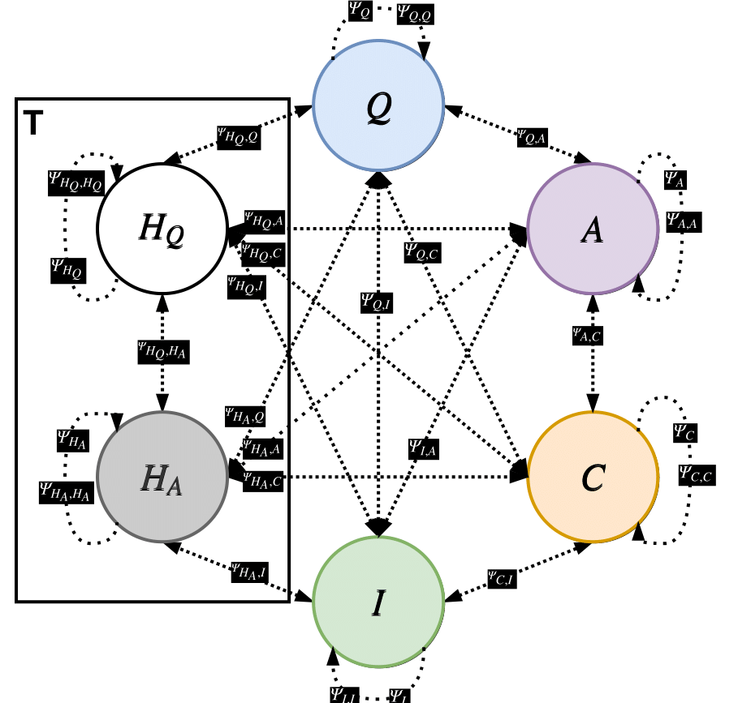

# Factor Graph Attention
* A general multimodal attention approach inspired by probabilistic graphical models. 
* Achieves a state-of-the-art performance (MRR) on visual dialog task.


This repository is the official implementation of [Factor Graph Attention](https://arxiv.org/abs/1904.05880).
(Appeared in CVPR'19)

<p float="left">
  
   
</p>

* Part of 2020 visual dialog challenge winning submission (https://github.com/idansc/mrr-ndcg)
* Use-case of FGA for videos can be found here (https://github.com/idansc/simple-avsd)

## Requirements

The model can easily run on a single GPU :)

To install requirements:

```setup
conda env create -f fga.yml
```

follows with:
```
 conda activate fga
```

## Preprocessed data:

Add the following files under data dir:

[visdial_params.json](https://technionmail-my.sharepoint.com/:u:/g/personal/idansc_campus_technion_ac_il/EUbM8rne2_BItNT8fR6MJXsBnzAMzUB7ssEc4Xt1Wza0lA?e=xCrKx8)

[visdial_data.h5](https://technionmail-my.sharepoint.com/:u:/g/personal/idansc_campus_technion_ac_il/ERCew1OvijJEmQ87wLDVesgByTwM2bty2frthgbdecNcFQ?e=w6Okhh)

Pretrained features:
- [VGG](https://technionmail-my.sharepoint.com/:u:/g/personal/idansc_campus_technion_ac_il/EW24M8TvIkpEmxgAGEml4UkBSvXkA98olGNwaRaK088-CA?e=Pwz8xz) A grid image features based on the VGG model pretrained on ImageNet *(Faster)*. Note, the h5 databases has slightly different dataset keys, therfore the code needs to be adapted accordingly. 
- [F-RCNN](https://technionmail-my.sharepoint.com/:u:/g/personal/idansc_campus_technion_ac_il/EYI1O4xal4NKvQXjTN-f4JIB2a-Jp3N6Bw_xpolFh2q69g?e=4koOZY) based on object detector with ResNetx101 backbone, 37 proposals, fine-tuned on [Visual Genome](https://visualgenome.org/). *Achives SOTA*. The file includes boxes and classes information. 

**Note:** You can use [CurlWget](https://chrome.google.com/webstore/detail/curlwget/dgcfkhmmpcmkikfmonjcalnjcmjcjjdn) to easily download the features on your server.

See the original paper for performance differences. I recommand using the FRCNN features, mainly because it is finetuned on the relevant VisualGenome dataset. 


## Training

To train the model in the paper, run this command:

```train
python train.py --batch-size  128 \
             --image_data "data/frcnn_features_new" \
             --test-batch-size 64 \
             --epochs 10 \
             --lr 1e-3 \
             --opt 0 \
             --folder-prefix "baseline" \
             --mode "FGA" \
             --initialization "he" \
             --lstm-initialization "he" \
             --log-interval 3000 \
             --test-after-every 1 \
             --word-embed-dim 200 \
             --hidden-ans-dim 512 \
             --hidden-hist-dim 128 \
             --hidden-cap-dim 128 \
             --hidden-ques-dim 512 \
             --seed 0
```

## Evaluation

To evaluate on the val split, provide a path using the model-pathname arg.
The path should contain a model file, `best_model_mrr.pth.tar`.

Call example:
```val eval
python train.py --batch-size  128 \
             --image_data "data/frcnn_features_new" \
             --test-batch-size 64 \
             --epochs 10 \
             --lr 1e-3 \
             --opt 0 \
             --only_val T \
             --model-pathname "models/baseline" \
             --folder-prefix "baseline" \
             --mode "FGA" \
             --initialization "he" \
             --lstm-initialization "he" \
             --log-interval 3000 \
             --test-after-every 1 \
             --word-embed-dim 200 \
             --hidden-ans-dim 512 \
             --hidden-hist-dim 128 \
             --hidden-cap-dim 128 \
             --hidden-ques-dim 512 \
             --seed 0
```

If you wish to create a test submission file (can be submitted to the challenge servers @ EvalAI)
replace only_val, with submission arg, i.e.:

```test eval
python train.py --batch-size  128 \
             --image_data "data/frcnn_features_new" \
             --test-batch-size 64 \
             --epochs 10 \
             --lr 1e-3 \
             --opt 0 \
             --submission T \
             --model-pathname "models/baseline" \
             --folder-prefix "baseline" \
             --mode "FGA" \
             --initialization "he" \
             --lstm-initialization "he" \
             --log-interval 3000 \
             --test-after-every 1 \
             --word-embed-dim 200 \
             --hidden-ans-dim 512 \
             --hidden-hist-dim 128 \
             --hidden-cap-dim 128 \
             --hidden-ques-dim 512 \
             --seed 0
```

## Pre-trained Models

You can download pertained models here:

- [best_model_mrr.pth.tar](https://technionmail-my.sharepoint.com/:u:/g/personal/idansc_campus_technion_ac_il/ERPmIvn5ebNJjvQuGFIMOtMB8c9y-ju1EI9YurJXUtEcGg?e=MunQsV) trained on VisDial1.0 using F-RCNN features


## Results

Evaluation is done on [VisDialv1.0](https://visualdialog.org/data).

Short description:

VisDial v1.0 contains 1 dialog with 10 question-answer pairs (starting from an image caption) on ~130k images
from COCO-trainval and Flickr, totalling ~1.3 million question-answer pairs. 

Our model achieves the following performance on the validation set, and similar results on test-std/test-challenge.

| Model name                   | R@1 |  MRR  |
| ---------------------------- |---- |------ |
| FGA                          | 53% |  66   |
| FGA                          | 53% |  66   |
| 5×FGA                        | 56% |  69   |

Note, the paper results may slightly vary from the results of this repo, since it is a refactored version.
For the legacy version, please contact via email

## Contributing

Please cite Factor Graph Attention if you use this work in your research:
```
@inproceedings{schwartz2019factor,
  title={Factor graph attention},
  author={Schwartz, Idan and Yu, Seunghak and Hazan, Tamir and Schwing, Alexander G},
  booktitle={Proceedings of the IEEE Conference on Computer Vision and Pattern Recognition},
  pages={2039--2048},
  year={2019}
}
```
