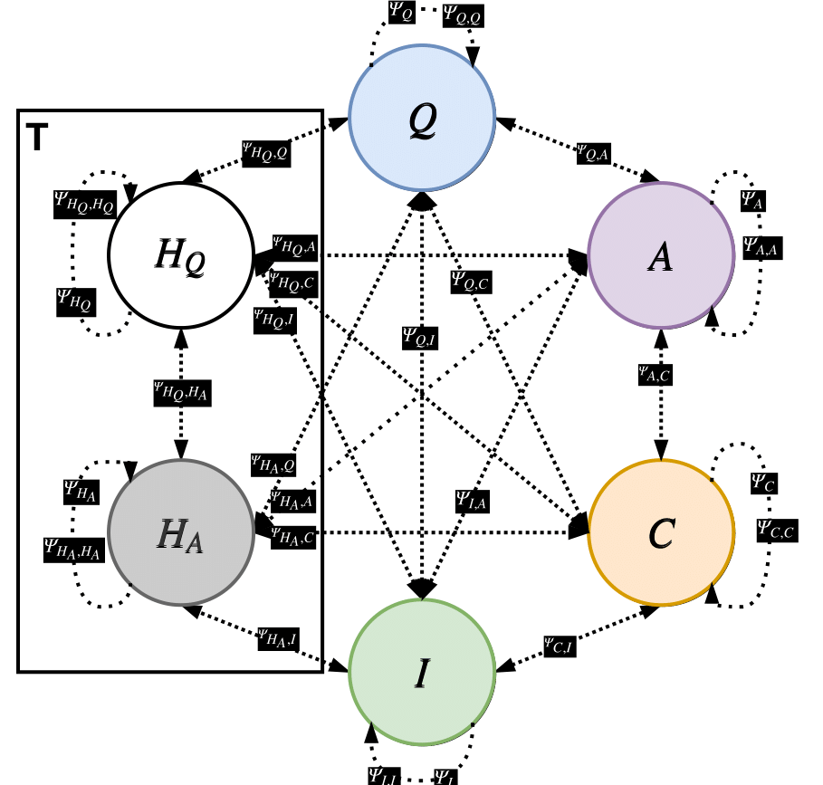
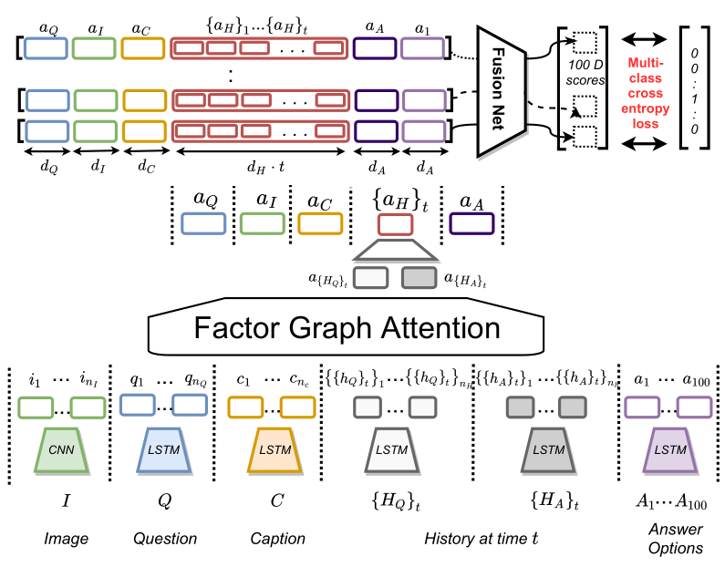

# Factor Graph Attention

A general multimodal attention approach inspired by probabilistic graphical
models. Give it any number of modalities — words, image regions, video frames,
candidate answers, dialog rounds — and it attends over all of them jointly.

This repository is the official implementation of
[Factor Graph Attention](https://arxiv.org/abs/1904.05880) (CVPR 2019). It
achieves state-of-the-art performance (MRR) on the visual dialog task, and was
part of the [2020 visual dialog challenge winning submission](https://github.com/idansc/mrr-ndcg).

<p float="left">
  
  
</p>

**Contents** — [Installation](#installation) · [Quick start](#quick-start) ·
[The attention layer](#the-attention-layer) · [Data](#data) ·
[Training](#training) · [Evaluation](#evaluation) ·
[Pre-trained models](#pre-trained-models) · [Results](#results) ·
[Other tasks](#other-tasks-on-the-same-layer) ·
[Notes on this refactor](#notes-on-this-refactor) ·
[Use cases of FGA](#use-cases-of-fga) · [Citation](#citation)

## Installation

```bash
pip install -e ".[train]"
```

The model runs on a single GPU, and also on CPU or Apple Silicon (MPS) — the
device is chosen for you.

## Quick start

FGA follows the standard `transformers` interfaces, so it composes with the rest
of the ecosystem:

```python
from fga import FGAConfig, FGAForVisualDialog

model = FGAForVisualDialog(FGAConfig(hidden_img_dim=2048))
outputs = model(**batch, labels=labels)   # outputs.loss, outputs.logits
ranking = outputs.logits.argsort(dim=-1, descending=True)

model.save_pretrained("models/fga")       # config.json + model.safetensors
model = FGAForVisualDialog.from_pretrained("models/fga")
```

`AutoConfig` / `AutoModel` resolve `model_type="fga"` once `fga` has been
imported, and `push_to_hub` / `from_pretrained("<user>/fga")` work as usual.

## The attention layer

The package is in two halves:

```
fga.attention    the general layer — no task assumptions
fga.tasks        the applications: visual_dialog, vqa, video_dialog,
                 video_retrieval, navigation
```

`fga.attention` is an ordinary `torch.nn` layer. A **modality** is any set of
entities carrying an embedding each: words in a sentence, regions in an image,
frames in a video, candidate answers, previous dialog rounds.

```python
import torch
from fga import FactorGraphAttention

attention = FactorGraphAttention(embed_dims=[512, 2048], num_entities=[20, 36])
text  = torch.randn(8, 20, 512)
image = torch.randn(8, 36, 2048)

pooled_text, pooled_image = attention(text, image)   # (8, 512), (8, 2048)
```

It composes like any other layer — drop it in an `nn.Module`, and `print(model)`
shows the graph it realizes:

```
FactorGraphAttention(modalities=[text:512, image:2048], factors=unary+self+pairwise)
```

Two optional arguments to `forward`:

```python
pooled, weights = attention(text, image, masks=[text_ids != 0, None], return_weights=True)
```

`masks` marks which entities exist, so padded positions are excluded from the
softmax — padding is not inert, since an encoder still emits a state there.
`return_weights` returns the per-modality attention distributions, which is what
you want for a visualization (`output_attentions=True` on the task models).

### Declaring modalities by name

Describe the graph by name rather than by parallel index-aligned lists, with each
modality declared explicitly — the nine history rounds are nine modalities — and
weight sharing stated separately:

```python
from fga import FactorGraphAttention, Modality

history = [
    Modality(f"history_{i}", dim=128, size=21, connected_to=("answer", "question"))
    for i in range(1, 10)
]

attention = FactorGraphAttention.from_modalities(
    [
        Modality("answer",   dim=512, size=100),
        Modality("question", dim=512, size=21),
        *history,
    ],
    share_weights=[[m.name for m in history]],
    use_prior=True,
)

print(attention.describe())
```

Each modality in a `share_weights` group is passed — and returned — as its own
`(batch, entities, dim)` tensor, while one set of factor weights serves the whole
group; that sharing is how nine history rounds stay affordable, and members must
agree on shape and connections, which is checked. `connected_to` is the
efficiency constraint: a modality sharing weights only interacts with the ones it
names. A typo in either raises instead of silently building a different graph.

The indexed spelling (`sharing_factor_weights={2: (9, [0, 1])}` with one packed
`(batch * repeats, ...)` tensor) still works — it is what the paper's code and
the published checkpoints use.

## Data

Add the following files under `data/`:

| File | What it is |
| --- | --- |
| `visdial_data.h5` | Tokenized dialogs, options and captions for train/val/test |
| `visdial_params.json` | Vocabulary (`word2ind`) and per-split image filenames |
| `visdial_1.0_val_dense_annotations.json` | Dense relevance judgements, required for NDCG — [visualdialog.org/data](https://visualdialog.org/data) |
| `frcnn_features_new.h5` | Image features: `{split}_features` of shape `(num_images, 37, 2048)` |

> **Note:** the SharePoint links previously listed here have expired. The dialog
> files can be rebuilt from the official VisDial v1.0 JSONs; the image features
> must be re-extracted (see below).

### On the HuggingFace Hub copies

`HuggingFaceM4/VisDial` and `jxu124/visdial` mirror VisDial v1.0 with the right
split sizes (123,287 / 2,064 / 8,000), but their schema is
`caption`, `dialog` as `[[question, answer], ...]`, `image_path`, `image` —
**no `answer_options`, no `gt_index`, no dense relevance**. FGA *ranks* 100
candidate answers, so those columns are exactly the ones it needs; the Hub copies
cannot replace `visdial_data.h5`. Dense annotations are only distributed by
[visualdialog.org/data](https://visualdialog.org/data).

They are, however, a convenient source of the **images** themselves
(`HuggingFaceM4/VisDial` ships them inline, ~21.8 GB), which is what you need to
re-extract the F-RCNN features.

Pretrained image features:

- **F-RCNN** — object detector with a ResNeXt-101 backbone, 37 proposals, fine-tuned on
  [Visual Genome](https://visualgenome.org/). *Achieves SOTA.* Recommended, mainly
  because it is finetuned on the relevant Visual Genome data.
- **VGG** — a grid image feature based on the VGG model pretrained on ImageNet
  (*faster*). Note the h5 uses slightly different dataset keys, so the loader
  needs adapting.

If you have the bottom-up-attention LMDB published with the
[VisDial challenge starter code](https://github.com/batra-mlp-lab/visdial-challenge-starter-pytorch),
convert it into the expected layout:

```python
from fga.image_features import lmdb_to_h5
from fga.data import image_ids_from_params, load_visdial_params

params = load_visdial_params("data/visdial_params.json")
lmdb_to_h5("features_val.lmdb", "data/frcnn_features_new.h5", "val", image_ids_from_params(params, "val"))
```

To exercise the pipeline before the real features are in place:

```bash
python scripts/make_dev_image_features.py --splits val --num_images 64 --output data/dev_features.h5
```

## Training

```bash
python scripts/run_visual_dialog.py \
    --image_features_path data/frcnn_features_new.h5 \
    --output_dir models/baseline \
    --do_train --do_eval \
    --per_device_train_batch_size 128 \
    --per_device_eval_batch_size 64 \
    --num_train_epochs 10 \
    --learning_rate 1e-3 \
    --word_embed_dim 200 \
    --hidden_ques_dim 512 --hidden_ans_dim 512 \
    --hidden_hist_dim 128 --hidden_cap_dim 128 \
    --eval_strategy epoch --save_strategy epoch \
    --load_best_model_at_end --metric_for_best_model mrr \
    --bf16 --seed 0
```

Training runs on `transformers.Trainer`, so mixed precision, gradient
accumulation, checkpoint resumption, early stopping and W&B/TensorBoard logging
are all available as standard flags. For multi-GPU, launch with
`torchrun --nproc_per_node=N` — the script needs no changes.

A ready-made SLURM job is in [`slurm/train_fga.sbatch`](slurm/train_fga.sbatch).

## Evaluation

Evaluate on the val split, reporting R@{1,5,10}, mean rank, MRR and NDCG:

```bash
python scripts/run_visual_dialog.py \
    --image_features_path data/frcnn_features_new.h5 \
    --model_name_or_path models/baseline --output_dir models/baseline \
    --do_eval --write_submission
```

Produce a test submission for the [EvalAI](https://evalai.cloudcv.org/) challenge server:

```bash
python scripts/run_visual_dialog.py \
    --image_features_path data/frcnn_features_new.h5 \
    --model_name_or_path models/baseline --output_dir models/baseline \
    --do_predict --write_submission
```

## Pre-trained models

| Weights | What it is |
| --- | --- |
| [Idan/fga](https://huggingface.co/Idan/fga) | The epoch-5 checkpoint below — MRR 66.01 |
| [Idan/fga-ndcg](https://huggingface.co/Idan/fga-ndcg) | Dense-finetuned — NDCG 69.07 |
| [Idan/fga-ensemble](https://huggingface.co/Idan/fga-ensemble) | The five members of 5×FGA — MRR 68.43 together |
| [Idan/fga-vqa](https://huggingface.co/Idan/fga-vqa) | Open-ended VQA v1 — 61.97 on val2014 |

The ensemble members are subfolders, so the reported 5×FGA number can be
reproduced rather than taken on trust:

```python
members = [FGAForVisualDialog.from_pretrained("Idan/fga-ensemble", subfolder=name)
           for name in ["frcnn", "seed1", "seed2", "seed3", "seed4"]]
```

Original `.pth.tar` checkpoints convert to the HuggingFace format with:

```bash
python scripts/convert_legacy_checkpoint.py \
    --checkpoint models/baseline/best_model_mrr.pth.tar \
    --output_dir models/fga-frcnn-hf \
    --image_feature_dim 2048
```

The converter strips `DataParallel` prefixes, renames the parameters to the
current module layout, and writes `config.json` + `model.safetensors`. Pass
`--push_to_hub Idan/fga` to publish. `tests/test_equivalence.py` checks that a
converted checkpoint reproduces the original model's scores exactly.

## Results

Evaluation is done on [VisDial v1.0](https://visualdialog.org/data), which
contains 1 dialog with 10 question-answer pairs (starting from an image caption)
on ~130k images from COCO-trainval and Flickr, totalling ~1.3 million
question-answer pairs.

Our model achieves the following performance on the validation set, and similar
results on test-std/test-challenge.

| Model name | R@1 | MRR |
| --- | --- | --- |
| FGA | 53% | 66 |
| 5×FGA | 56% | 69 |

### Reproduced with this code

Trained from scratch with the commands above — 10 epochs on 8×L40S, about 3 hours —
using image features re-extracted with the same Visual-Genome-finetuned detector,
since every published copy of the originals is now offline.

| Epoch | R@1 | R@5 | R@10 | MRR | Mean rank | NDCG |
| --- | --- | --- | --- | --- | --- | --- |
| 1 | 44.09 | 73.67 | 83.39 | 57.85 | 5.95 | 49.16 |
| 3 | 50.66 | 81.36 | 89.75 | 64.48 | 4.18 | 55.28 |
| **5** | **52.46** | **82.95** | **90.97** | **66.01** | **3.92** | 56.46 |
| 7 | 52.23 | 83.05 | 90.70 | 65.79 | 3.98 | 57.44 |
| 10 | 51.23 | 81.48 | 89.81 | 64.68 | 4.31 | **58.19** |

MRR peaks at epoch 5 and matches the published 66; R@1 comes in 0.54 lower. NDCG keeps
climbing after MRR has turned over, which is the metric tension the
[2020 challenge submission](https://github.com/idansc/mrr-ndcg) dealt with — checkpoints
are saved every epoch so you can select per metric.

### Optimizing NDCG instead

The sparse label calls one candidate correct and 99 equally wrong, which is what MRR
measures. NDCG instead scores against the graded relevance five annotators gave every
candidate — and for "is it daytime?" the list contains *yes*, *yeah* and *yes it is*.
Finetuning on that graded signal moves NDCG a long way, at the cost of MRR:

| Objective | NDCG | MRR | R@1 | R@5 | R@10 | Mean rank |
| --- | --- | --- | --- | --- | --- | --- |
| sparse only (baseline) | 56.46 | **66.01** | 52.46 | 82.95 | 90.97 | 3.92 |
| dense only | **69.07** | 49.03 | 34.27 | 66.15 | 80.13 | 6.68 |
| dense + sparse (0.5) | 68.00 | 61.93 | 49.55 | 76.59 | 86.14 | 5.07 |
| dense + sparse (1.0) | 66.61 | 63.27 | 50.69 | 78.33 | 87.38 | 4.78 |
| ApproxNDCG | 62.43 | 57.90 | 45.05 | 73.56 | 84.21 | 6.14 |

Trained on the 2,000-image dense subset of *train*; the val annotations are never
trained on. `sparse_weight=1.0` is the knee of the curve — 10 of the 12.6 available NDCG
points for 2.7 MRR, where the pure-dense end gives up 17 MRR for the last 2.5.

A smooth approximation of NDCG itself (ApproxNDCG, Qin et al.) is implemented too and is
clearly worse here, most likely because it concentrates gradient on the few positions the
discount rewards while the soft cross entropy draws signal from all 100 candidates —
which matters with only 2,000 examples.

```bash
python scripts/finetune_dense.py \
    --model_name_or_path models/fga/checkpoint-XXXX \
    --train_dense_path data/visdial_1.0_train_dense_annotations.json \
    --output_dir models/fga-ndcg --loss soft_ce --sparse_weight 1.0 \
    --learning_rate 1e-4 --num_train_epochs 5
```

### Ensembling

The paper reports 5×FGA alongside the single model. `scripts/ensemble_eval.py` combines
checkpoints by averaging either scores or ranks — the latter being scale-free, which
matters when mixing an MRR model with a dense-finetuned one, whose score distributions
differ sharply:

```bash
python scripts/ensemble_eval.py --models models/fga-seed*/checkpoint-* --combine score rank
```

Five models trained from different seeds, evaluated on VisDial v1.0 val:

| | NDCG | MRR | R@1 | R@5 | R@10 | Mean rank |
| --- | --- | --- | --- | --- | --- | --- |
| best single member | 56.07 | 65.46 | 51.76 | 82.51 | 90.47 | 4.01 |
| **5×FGA, score-averaged** | 60.86 | **68.43** | **55.26** | 85.06 | 92.52 | 3.47 |
| 5×FGA, rank-averaged | 60.82 | 67.37 | 53.90 | 84.07 | 92.11 | 3.56 |

against the published 5×FGA at MRR 69 and R@1 56%. Averaging scores beats averaging
ranks here, which is what you would expect from five members of one architecture: their
scores are already on a comparable scale, so the rank transform only discards magnitude.

Two things that did **not** work are worth recording, because both are the obvious
thing to try:

* **Picking each seed's best checkpoint made the ensemble slightly worse** — 68.27
  MRR against 68.43 for the last checkpoints, even though the swap brings in the
  66.01 model in place of a 64.68 one. Ensembles are made by disagreement, not by
  member strength, and checkpoints selected on the same metric agree more.
* **Stacking all 26 checkpoints** of the five runs gave 68.40 / 60.33 — no better
  than five. Extra checkpoints of a run you already have add nothing; the diversity
  has to come from the seeds.

### Ensembling for NDCG

The dense-finetuned models can be combined the same way, and here the answer is
different again:

| Ensemble | NDCG | MRR | R@1 | R@5 | R@10 | Mean rank |
| --- | --- | --- | --- | --- | --- | --- |
| best single dense model | **69.07** | 49.03 | 34.27 | 66.15 | 80.13 | 6.68 |
| 4 dense models, score-averaged | 67.68 | 60.45 | 47.69 | 75.89 | 86.15 | 5.13 |
| 4 dense models, rank-averaged | 67.87 | 59.87 | 47.08 | 75.11 | 85.88 | 5.21 |
| 5 sparse + 4 dense, score-averaged | 64.96 | **66.79** | 53.60 | 83.45 | 91.46 | 3.73 |
| 5 sparse + 4 dense, rank-averaged | 65.63 | 65.15 | 51.79 | 81.83 | 90.44 | 3.96 |

Ensembling the dense models *loses* 1.4 NDCG against the best one alone, because the
four are not equally good — 69.07, 68.00, 66.61 and 62.43 — and averaging drags the
best toward the rest. An ensemble helps when members disagree about which candidate
is best, not when they disagree about how good they are.

Mixing the two families is the useful case. At 64.96 NDCG and 66.79 MRR it beats
every dense model on MRR by 5 points and every sparse model on NDCG by 6, which no
single checkpoint on the trade-off curve manages. And this is the one place rank
averaging earns its keep: it gains 0.7 NDCG over score averaging, because a
soft-label-finetuned model's scores are on a visibly different scale and the rank
transform is what makes the two comparable. It costs MRR to buy that, so which rule
to use follows from which metric is being submitted.

The two metrics disagreeing is the subject of the
[2020 challenge submission](https://github.com/idansc/mrr-ndcg).

Note, the paper results may slightly vary from the results of this repo, since it is a
refactored version. For the legacy version, please contact via email.

## Other tasks on the same layer

Visual Dialog above is the paper's own task. The layer is not specific to it —
these are the published follow-ups, each rebuilt on the same attention.

### Visual Question Answering

`fga.tasks.vqa` is a second application, on VQA v1. Use **`OpenEndedVQAModel`**:
the question and the image are attended, and the answer is chosen from the answer
vocabulary.

```python
from fga.tasks.vqa import OpenEndedVQAConfig, OpenEndedVQAModel

model = OpenEndedVQAModel(OpenEndedVQAConfig())
out = model(question_input_ids=question, image_features=regions, answer_scores=scores)
```

```bash
python scripts/prepare_vqa.py --raw_dir vqa/raw --features_dir features --output_dir vqa
python scripts/run_vqa_open.py --vqa_dir vqa --output_dir models/vqa \
    --do_train --do_eval --per_device_train_batch_size 512 \
    --learning_rate 2e-3 --num_train_epochs 20 --bf16
```

#### Results

Trained on **COCO train2014** (230,084 questions), scored on **all of val2014**
(121,512 questions) with 36 bottom-up region features. `vqa_accuracy` implements
the official metric — the answer normalization, and the average over the ten
leave-one-annotator-out subsets.

| objective | 20 epochs | 40 epochs |
| --- | --- | --- |
| **`soft_ce`** — softmax against the graded scores | 61.55 | **61.97** |
| `bce` — sigmoid against the same scores | 60.71 | |
| `ce` — one label | 60.47 | |

> The published open-ended number, **66.7**, is measured on **test-dev** after
> training on train2014 **and** val2014. That is a different protocol on both
> axes: about 50% more training data, and an evaluation set whose labels are not
> public — the only way to produce that number is a submission to the evaluation
> server. Training on train and scoring on val is what can be run locally, and
> 62.07 is that number, not a failed 66.7.

VQA is graded rather than single-label — ten annotators answer each question, and
an answer earns `min(matches/3, 1)`. Supervising those scores instead of one
"correct" id is worth about a point, and `soft_ce` is the default for that reason.
The sigmoid form is what the [2017 challenge writeup](https://arxiv.org/abs/1708.02711)
recommends; here the softmax form is 0.8 better, which is worth knowing before
copying the recipe. Accuracy is flat over the last ten epochs — it moves between
61.97 and 62.07 with no trend — so this is converged rather than a stopping point.
The figure quoted is the final epoch, which is the checkpoint that ships; the
62.07 seen mid-run was not saved.

By answer type: yes/no 78.6, number 37.4, other 54.6.

#### The ternary factor

The layer supports a factor over three modalities at once, from
[HighOrderAtten](https://github.com/idansc/HighOrderAtten) — *High-Order Attention
Models for Visual Question Answering* (NeurIPS 2017). It scores
`(region, word, answer)` triples directly:

```
T[x, y, z] = sum_d  X[x, d] * Y[y, d] * Z[z, d]
```

A triple can be jointly consistent while no two of its parts stand out on their
own, so pairwise factors cannot express this. Declare one on any three modalities:

```python
FactorGraphAttention(
    embed_dims=[512, 512, 512],
    num_entities=[15, 196, 18],
    modality_names=["question", "image", "answer"],
    ternary_interactions=[("question", "image", "answer")],
)
```

Each member then merges one extra potential. The interaction tensor is `x*y*z`
values per example — about 53k at VQA sizes — so it is affordable for three
modalities and would not be for four.

`HighOrderAttentionForVQA` uses it, taking the eighteen multiple-choice candidates
as the third modality. **It is not the recommended model**, and the results above
are the open-ended one. Its architecture has been checked against the original
line by line — the masked softmax, the two-stream question encoder, the count
sketch bins and signs, the objective, the image encoder — and it reaches 61.4,
but it scores *below* the open-ended model despite being handed eighteen
candidates to choose between, which it should not. Something in that model is
wrong and is not yet found, so it is kept for the factor rather than offered as a
reproduction.

The fusion head uses Compact Bilinear Pooling, implemented in
`fga.tasks.vqa.pooling` via the Count Sketch and an FFT, which approximates the
`d^2` outer product in `O(d + m log m)`.

### Video dialog, retrieval and navigation

One package per task, and the whole set at a glance:

| package | task | modalities | output |
| --- | --- | --- | --- |
| `visual_dialog` | rank answers about an image | answers, question, caption, image, 2×history | ranking |
| `vqa` | open-ended VQA | question, image | classification |
| `video_dialog` | audio-visual scene-aware dialog | question, 4 video streams, audio | decoder state |
| `video_retrieval` | text-to-video retrieval | clips, query words | contrastive score |
| `navigation` | target-driven navigation | target object, observation grid | policy + value |

```python
from fga.tasks.video_dialog import AVSDConfig, AVSDEncoder
from fga.tasks.video_retrieval import VideoMatchConfig, VideoMatchModel
from fga.tasks.navigation import NavigationConfig, NavigationPolicy
```

They differ in more than their inputs, which is the point: Visual Dialog and VQA
rank or classify, retrieval trains contrastively with no classifier at all, and
navigation emits a policy for reinforcement learning. Each exercises the same
attention differently —

* **video dialog** attends four spatio-temporal streams separately, then fuses
  them with an LSTM over the stream axis, so moments can be compared after the
  model has decided what to look at within each;
* **retrieval** declares no entity counts, so the pairwise factors
  mean-marginalize and clip/word counts may vary per example;
* **navigation** carries a recurrent state across an episode and, uniquely here,
  does *not* pool: the attention re-weights each grid cell and the whole map is
  flattened into the recurrent state, because the agent must know where the
  target is, not only that it is present.

`visual_dialog` and `vqa` are trained end to end on real data. The other three
ship models and tests but no data pipeline — AVSD's features went with the same
expired links as VisDial's, VideoMatch's were never published, and navigation
needs the AI2-THOR simulator. For those, `scripts/functional_train.py` trains each
on synthetic data with planted structure and checks the model recovers it on
held-out examples: retrieval R@1 1.000 among 500 distractors, video dialog 1.000
at identifying which of four streams matches the question, navigation 1.000 at
acting toward the target's quadrant under REINFORCE. That certifies the wiring,
not task accuracy.

### Compatibility with the forks

The naming used by those forks is accepted as-is, so this package is a drop-in:
`util_e` / `sizes` for `embed_dims` / `num_entities`, `prior_flag` /
`pairwise_flag` / `unary_flag` / `self_flag` for the `use_*` arguments, `Utility`
for `Modality`, and the AVSD spelling `high_order_utils=[(idx, repeats, connected)]`
with `size_flag` for `sharing_factor_weights`.

`FGAConfig` takes the same form:

```python
FGAConfig(share_weights=[
    {"modalities": [f"history_question_{i}" for i in range(1, 10)],
     "connected_to": ["answer", "question"]},
    {"modalities": [f"history_answer_{i}" for i in range(1, 10)],
     "connected_to": ["answer", "question"]},
])
```

The connections sit on the group rather than on each member, since modalities
sharing weights must agree on them. The indexed `sharing_factor_weights` remains
the serialized field, so published checkpoints keep loading, and
`config.share_weights` renders it back as named groups.

## Notes on this refactor

The math is unchanged and covered by an equivalence test against the original
code, which is preserved verbatim in `tests/legacy_reference/`. Three fixes do
change behaviour:

* **Unary dropout at evaluation.** The original called `F.dropout(...)` without
  forwarding `self.training`, so activations were dropped during evaluation and
  scores were non-deterministic even under `model.eval()`.
* **Padding embedding.** The padding row was randomly initialized and, because
  `padding_idx` zeroes its gradient, stayed random. It is now zero.
* **Option lengths without `--astop`.** That branch indexed the answer-length
  table by round instead of by option, producing a scalar where 100 lengths were
  needed. The default path (`astop=True`) was unaffected.

Six `margin_Y` convolutions in the self-interaction factors were computed and
discarded on every forward pass; they are gone, and the converter drops the
corresponding untrained weights.

Run the tests with `pytest`. The data tests skip automatically when
`data/visdial_data.h5` is absent.

## Use cases of FGA

* Video dialog, spatial interactions between frames, can be found here
  (https://github.com/idansc/simple-avsd)
* Spatial navigation, can be found here
  (https://github.com/barmayo/spatial_attention)
* Video retrieval, between text query and clips, can be found here
  (https://github.com/AmeenAli/VideoMatch)

Each is also ported onto this layer under `fga.tasks/` — see
[The other tasks in this package](#the-other-tasks-in-this-package).

## Citation

Please cite Factor Graph Attention if you use this work in your research:

```bibtex
@inproceedings{schwartz2019factor,
  title={Factor graph attention},
  author={Schwartz, Idan and Yu, Seunghak and Hazan, Tamir and Schwing, Alexander G},
  booktitle={Proceedings of the IEEE Conference on Computer Vision and Pattern Recognition},
  pages={2039--2048},
  year={2019}
}
```

If you use the ternary factor or the VQA model, please also cite:

```bibtex
@inproceedings{schwartz2017high,
  title={High-Order Attention Models for Visual Question Answering},
  author={Schwartz, Idan and Schwing, Alexander G and Hazan, Tamir},
  booktitle={Advances in Neural Information Processing Systems},
  year={2017}
}
```
